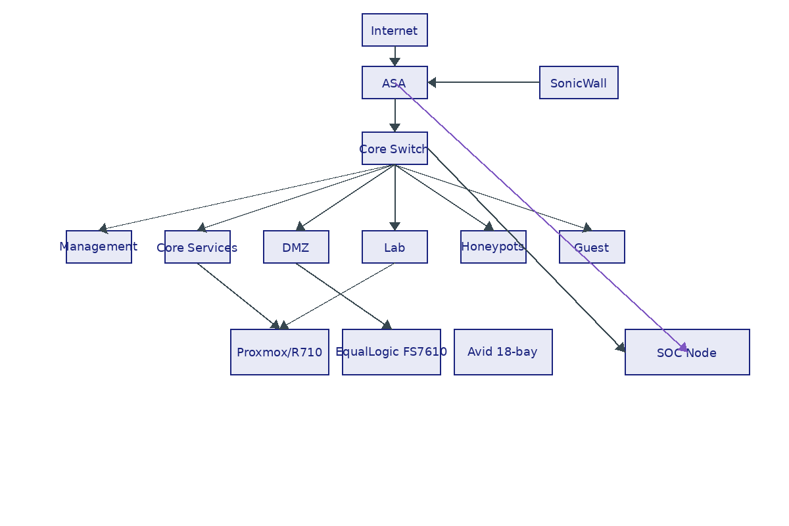

# Network Architecture (Sanitized Overview)

This document describes the logical network layout of the Digital Fortress Lab: VLANs, zones, and the main traffic flows between them. IP ranges and some identifiers are intentionally sanitized; the focus is on structure rather than exact addresses.

## Zones and VLANs

The lab is divided into several functional zones. Each zone corresponds to one or more VLANs on the core switch and to specific policy on the firewalls.

| Zone        | Example VLAN ID | Role / Typical Hosts                                 |
|------------|------------------|------------------------------------------------------|
| Management | 10               | Switch, firewalls, console manager, lights‑out controllers, SOC |
| Core       | 20               | Proxmox nodes, storage, shared infrastructure services         |
| DMZ        | 30               | Public‑facing lab services                                 |
| Lab        | 40               | General workloads, test VMs                                |
| Honeypots  | 50               | Intentionally exposed services                            |
| Guest      | 60               | Untrusted devices, Wi‑Fi clients                          |

> **Note:** VLAN IDs and IP ranges above are examples only and do not reflect the exact addressing scheme in use. They are provided to illustrate relative trust levels and segmentation.

## Routing Model

- The core switch provides Layer‑2 segmentation for each VLAN.
- Inter‑VLAN routing is performed by the firewalls, not by the switch.
- Management traffic originates from the Management zone and is allowed to reach infrastructure devices under strict rules.
- Lab and Guest zones have restricted outbound access and limited visibility into other zones.

## Traffic Flows (Conceptual)

- **Internet ↔ ASA/SonicWall ↔ DMZ**  
  Used for testing externally reachable services and remote access via VPN.

- **Lab/Guest ↔ ASA ↔ Internet**  
  Outbound access is controlled and logged; selected flows are mirrored to Suricata for inspection.

- **Honeypots ↔ ASA ↔ Internet**  
  Inbound scan/attack traffic is allowed in a controlled way, with tight outbound restrictions and full monitoring.

- **Management ↔ All Zones (controlled)**  
  Administrative protocols (SSH, HTTPS, console) are only permitted from specific management endpoints.

## Monitoring and DPI

The Panasonic Toughbook CF‑30 SOC node (NST/SELKS) receives:

- Mirrored traffic from selected switch ports and/or firewall interfaces via SPAN sessions.
- Firewall logs (connections, VPN events, system messages).
- Logs from Proxmox, core services, honeypot hosts, and other selected systems.

The intent is to inspect important traffic once at well‑chosen points rather than duplicating the same flows across multiple tools. Suricata signatures and alert thresholds can be tuned using traffic from the Honeypot and Lab zones without affecting production systems.

## Diagram

The following diagram illustrates the high‑level layout of zones, the core switch, and the firewalls. Arrows represent typical traffic flows and monitoring paths.  

